# Airflow Projects Repository

This repository contains several Airflow DAG projects maintained by the Analytics Engineering and DataOps teams. Each project lives in its own directory and serves a distinct operational need:

## Projects

1. **Lake-to-DWH Cross-Notification Pipeline**  
   Dynamically generates staging DAGs in the Data Warehouse Airflow instance to run dbt models whenever upstream Lake tables are refreshed. Uses Airflow `Dataset` for cross-instance triggers.

2. **Payment Volume Pacing DAG**  
   Runs daily to project end-of-month payment volumes per method based on business-day pacing logic, writes results to Redshift, and powers a live Tableau dashboard for operational decision-making.

3. **Airflow DagRun Export DAG**  
   Exports recent `DagRun` metadata from the Airflow metastore into Redshift tables, enabling easy historical query and SLA monitoring beyond the limitations of Airflow’s native metastore.

4. **DBT Drop Redshift View or Table DAG**  
   A manual-triggered DAG that drops specified Redshift tables or views via runtime config, allowing analytics engineers to manage schema cleanup without needing direct console access.
   
## Directory Structure

```text
.
├── lake_to_dwh/
│   └── generate_stg_dags.py
│   └── README.md
├── payment_pacing/
│   └── payment_pacing_dag.py
│   └── README.md
├── dagrun_export/
│   └── airflow_dagrun_export.py
│   └── README.md
├── drop_redshift/
│   └── dbt_drop_redshift.py
│   └── README.md
├── misc/
│   └── task_delay.py
│   └── README.md
└── README.md        # ← This overview file
```

## License

This code is licensed under the MIT License. See [LICENSE](LICENSE) for details.

```mermaid

flowchart TD
  %% Base tables → support_contacts
  cx_assisted_support_contacts["ref('cx_assisted_support_contacts')"] --> support_contacts
  cxo_assisted_ces_survey_enterprise_enriched["ref('cxo_assisted_ces_survey_enterprise_enriched')"] --> support_contacts
  cxo_assisted_ces_themes["ref('cxo_assisted_ces_themes')"] --> support_contacts

  %% Base tables → contacts_handled
  cxo_assisted_support_handled_contacts_events["ref('cxo_assisted_support_handled_contacts_events')"] --> contacts_handled
  support_contacts --> contacts_handled

  %% Metrics sourced directly from support_contacts
  support_contacts --> ces_response_count
  support_contacts --> effort_score
  support_contacts --> effort_score_onestars
  support_contacts --> effort_score_fivestars
  support_contacts --> resolution_rate
  support_contacts --> advocate_sat
  support_contacts --> ces_feedback
  support_contacts --> feedback_sentiment
  support_contacts --> base_themes
  support_contacts --> offered_volume

  %% Metrics sourced from contacts_handled
  contacts_handled --> handled_volume
  contacts_handled --> fcr_rate
  contacts_handled --> asa_secs
  contacts_handled --> system_asa_secs
  contacts_handled --> talk_time_secs
  contacts_handled --> hold_time_secs
  contacts_handled --> work_time_secs
  contacts_handled --> total_handle_time_secs

  %% All metrics → combined_metrics
  ces_response_count --> combined_metrics
  effort_score --> combined_metrics
  effort_score_onestars --> combined_metrics
  effort_score_fivestars --> combined_metrics
  resolution_rate --> combined_metrics
  advocate_sat --> combined_metrics
  ces_feedback --> combined_metrics
  feedback_sentiment --> combined_metrics
  base_themes --> combined_metrics
  handled_volume --> combined_metrics
  offered_volume --> combined_metrics
  fcr_rate --> combined_metrics
  asa_secs --> combined_metrics
  system_asa_secs --> combined_metrics
  talk_time_secs --> combined_metrics
  hold_time_secs --> combined_metrics
  work_time_secs --> combined_metrics
  total_handle_time_secs --> combined_metrics

  %% Final select
  combined_metrics --> final_output["SELECT * FROM combined_metrics"]
```


