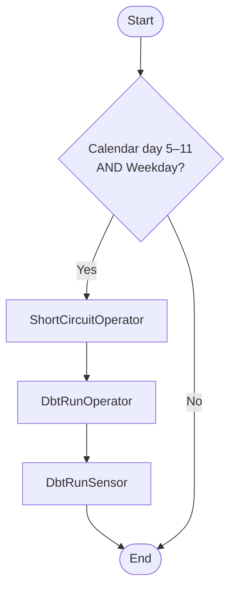

# Monthly GAAP Revenue Allocation DAG

## Overview
This project defines an Apache Airflow DAG that runs a monthly GAAP revenue allocation job. The DAG uses a `ShortCircuitOperator` to only execute downstream tasks on weekdays falling between the 5th and 11th of each month.

## Components
- **ShortCircuitOperator**: Checks calendar day and business day conditions in a single operator.
- **DbtRunOperator**: Triggers a dbt job named "Monthly Job".
- **DbtRunSensor**: Waits for the dbt job to complete before proceeding.

## Scheduling
- **Cron expression:** `30 17 * * *` (daily at 10:30 AM PT on a UTC-based Airflow scheduler)
- **Execution gate:** Only when the date is a weekday (Mon–Fri) between the 5th and 11th of the month.

## Usage Example
```python
@gdag(
    dag_id='monthly_job',
    schedule='30 17 * * *',
    default_args=default_args
)
def monthly_job():
    def is_calendar_and_business_day(check_date=None):
        if check_date is None:
            check_date = datetime.utcnow().date()
        # 1) between 5th–11th of month
        if not (5 <= check_date.day <= 11):
            return False
        # 2) Mon–Fri only
        return check_date.weekday() < 5

    gate = ShortCircuitOperator(
        task_id='check_calendar_and_business_window',
        python_callable=is_calendar_and_business_day,
    )

    dbt_run = DbtRunOperator(
        task_id='dbt_run',
        job_name='Monthly Job',
    )

    wait = DbtRunSensor(
        task_id='wait_for_dbt',
        run_id='{{ ti.xcom_pull(task_ids="dbt_run") }}',
    )

    gate >> dbt_run >> wait

dag = monthly_job()
```

## DAG Flow

