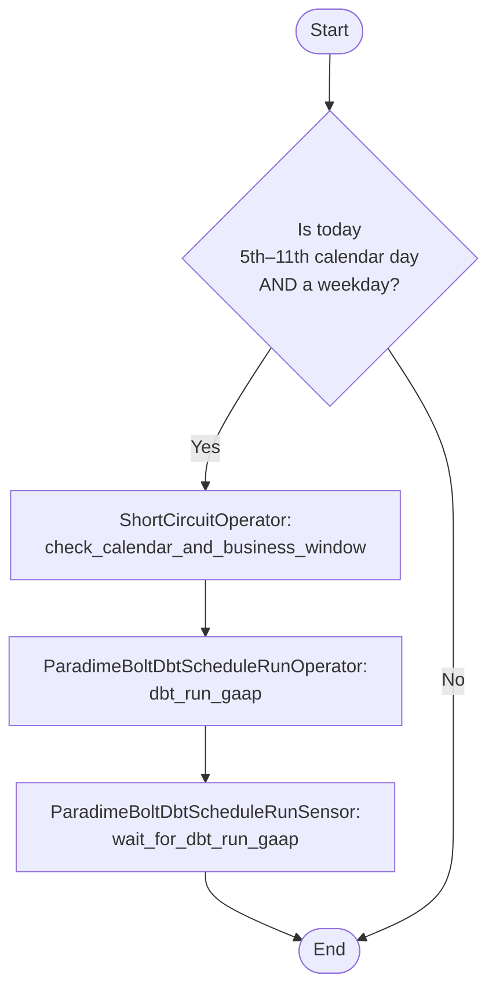

```mermaid
flowchart TD
  A([Start]) --> B{Is today<br/>5th–11th calendar day<br/>AND a weekday?}
  B -- Yes --> C[ShortCircuitOperator:<br/>check_calendar_and_business_window]
  C --> D[ParadimeBoltDbtScheduleRunOperator:<br/>dbt_run_gaap]
  D --> E[ParadimeBoltDbtScheduleRunSensor:<br/>wait_for_dbt_run_gaap]
  E --> F([End])
  B -- No --> F
```
