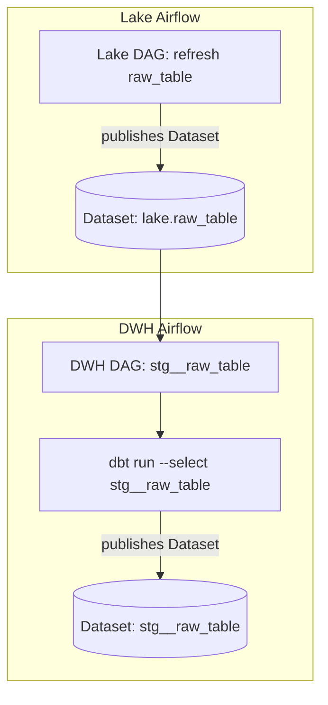

# Lake-to-DWH Cross-Notification Pipeline

A dynamic, configurable Airflow-based project that synchronizes data refreshes between two separate Airflow instances — one owned by the Lake team and one owned by the Data Warehouse (DWH) team — to ensure both environments stay in sync.

---

## Table of Contents

1. [Project Overview](#project-overview)
2. [Architecture & Workflow](#architecture--workflow)
3. [Configuration](#configuration)
4. [Dynamic DAG Generation](#dynamic-dag-generation)
5. [Key Components](#key-components)
6. [Usage](#usage)
7. [Extensibility & Future Enhancements](#extensibility--future-enhancements)

---

## Project Overview

This project bridges two independently owned Airflow environments:

- **Lake Airflow**: Runs "bronze" or raw ingestion and transforms in the Data Lake.
- **DWH Airflow**: Runs modeling, aggregation, and marts in the Data Warehouse.

Instead of manually replicating DAG definitions, we dynamically generate "cross-notification" DAGs in the DWH instance based on a simple JSON configuration. Whenever a Lake table is refreshed, the corresponding DWH DAG automatically triggers a dbt run to refresh that model.

---

## Architecture & Workflow



1. **Lake DAG** updates a table and publishes a `Dataset('lake.<table>')`.
2. **DWH Airflow**, listening on that dataset, automatically schedules the matching `stg__<table>` DAG.
3. The `stg__<table>` DAG runs a `DWHOperator` to invoke `dbt run` and `dbt retry` on the staging model.
4. Upon success, it publishes a downstream `Dataset('stg__<table>')` for further consumption.

---

## Configuration

All DAG definitions are driven by a single JSON file (`lake_dags.json`). Each entry has:

```json
[
  {
    "dag_name": "lake-info",
    "outlets": [
      "public.info",
      "dataplatform.info"
    ]
  },
  {
    "dag_name": "datalake-action",
    "outlets": [
      "public.action",
      "dataplatform.action"
    ]
  }
  // ...
]
```

- **`dag_name`**: Logical name for the table or domain.
- **`outlets`**: Upstream dataset identifiers in the Lake Airflow instance; the first matching prefix (`public.` in dev, `dataplatform.` in prod) is used as the trigger.


---

## Dynamic DAG Generation

In your Airflow `dags/` folder, include a Python file (`generate_stg_dags.py`) that:

1. Reads the JSON config (from local FS in dev, or S3 in prod).  
2. Loops through each config entry and picks the appropriate outlet.  
3. Constructs a DAG ID of the form `stg__<table_name>`.  
4. Schedules it on the upstream `Dataset(outlet)`.  
5. Defines a single `DWHOperator` task which runs:
   ```bash
   dbt run --select stg__<table_name> --target prod &&    dbt retry --target prod
   ```
6. Publishes `Dataset(f"stg__{table_name}")` as the downstream output.

By assigning each DAG into `globals()[dag_id]`, Airflow automatically discovers and parses them at startup.

---

## Key Components

- **`Dataset`**: Airflow abstraction to link producer and consumer DAGs across instances.
- **`DWHOperator`**: Custom operator that wraps a shell command (dbt run & retry) and handles result logging.
- **`task_fail_slack_alert`**: Callback to post failures to Slack.
- **`generate_stg_dags.py`**: Dynamically creates staging DAGs based on JSON config.

---

## Usage

1. Place `lake_dags.json` in:
   - `dags/conf/` (dev)
   - Or in S3 under `<bucket>/lake_dags.json` (prod)
2. Configure `ENVIRONMENT` env var in your Kubernetes/virtualenv to `dev` or `prod`.
3. Deploy the `generate_stg_dags.py` file into your DWH Airflow `dags/` directory.
4. Ensure your Lake Airflow DAGs publish to the matching `Dataset` names.
5. Watch the DWH instance automatically spin up DAGs and run your staging models.

---

## Extensibility & Future Enhancements

- **TaskGroups**: Group multi-step models into logical units.
- **Parameterization**: Pass additional dbt flags or environments in JSON.
- **Conditional retries**: Customize retry logic based on error patterns.
- **Monitoring**: Integrate with DataDog or Prometheus for SLA monitoring.
- **Visualization**: Add a summary dashboard of dataset latencies.

