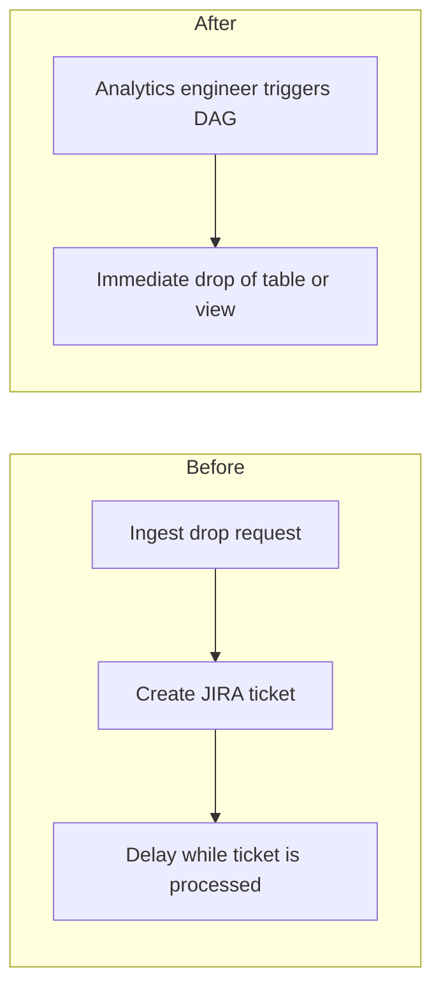
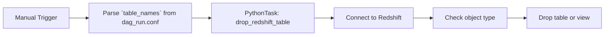

# DBT Drop Redshift View or Table DAG

A manual-triggered Airflow DAG that drops specified Redshift tables or views based on runtime configuration, enabling the analytics engineering team to manage schema cleanup without direct console access.

---

## Table of Contents

1. [Background](#background)
2. [Process Before & After](#process-before--after)
3. [Project Overview](#project-overview)
4. [Architecture & Workflow](#architecture--workflow)
5. [Configuration](#configuration)
6. [Key Components](#key-components)
7. [Usage](#usage)
8. [Extensibility & Future Enhancements](#extensibility--future-enhancements)

---

## Background

The analytics engineering team lacks direct Redshift console privileges but needs to drop outdated or incremental tables quickly.  
This DAG runs with the team’s existing dbt-read permissions and bypasses ticketing overhead, reducing time to market for schema cleanup.

---

## Process Before & After



- **Before**: Requests were formal—submit a ticket, await approval, and wait for scheduled maintenance.  
- **After**: Using this DAG, the engineering team triggers the drop instantly without external dependencies.

---

## Project Overview

The **dbt_drop_redshift_view_or_table** DAG:

1. Is manually triggered with a JSON configuration specifying one or more `schema.table` names.  
2. Connects to Redshift via `psycopg2` using Airflow Variables for credentials.  
3. Checks each object’s type (`BASE TABLE` or `VIEW`).  
4. Drops it with `CASCADE` if it exists.

---

## Architecture & Workflow



1. **Trigger**: No schedule; run on-demand via UI or API.  
2. **Parse Config**: Reads `dag_run.conf["table_names"]` for target objects.  
3. **Execution**: For each name, logs type and issues `DROP TABLE` or `DROP VIEW`.  
4. **Completion**: Success and failure callbacks notify via Slack.

---

## Configuration

### Airflow Variables

| Variable               | Description                       |
|------------------------|-----------------------------------|
| `REDSHIFT_HOST`        | Redshift endpoint                 |
| `REDSHIFT_DBNAME`      | Database name                     |
| `REDSHIFT_USER`        | Username                          |
| `REDSHIFT_PASSWORD`    | Password                          |

### DAG Runtime Config (`dag_run.conf`)

Pass a JSON object when triggering:

```json
{
  "table_names": [
    "schema.first_table",
    "schema.second_view"
  ]
}
```

---

## Key Components

- **`_create_logger`**: Standardizes stdout logging with timestamps and context.  
- **`drop_redshift_table`**: Core function that:
  - Reads `table_names` from `dag_run.conf`.  
  - Connects and queries `information_schema.tables`.  
  - Drops objects with `CASCADE`.  
- **Airflow DAG**: A single `PythonOperator` with manual trigger and SLA of 15 minutes.  
- **Slack Callbacks**: Notify on success and failure.

---

## Usage

1. **Deploy** this DAG file into your Airflow `dags/` directory.  
2. **Ensure** Airflow Variables for Redshift are set.  
3. **Trigger** the DAG in UI or via API, supplying `{"table_names": [...]}`.  
4. **Monitor** logs for drop operations and Slack notifications.

---

## Extensibility & Future Enhancements

- **Dry-Run Mode**: Add a flag to log actions without dropping.  
- **Bulk Operations**: Use parallel tasks or TaskGroup for large lists.  
- **Role Enforcement**: Validate permissions before drop.  
- **Wildcard Support**: Allow schema-wide drops with patterns.  
- **Audit Table**: Record drop history in Redshift for lineage.
