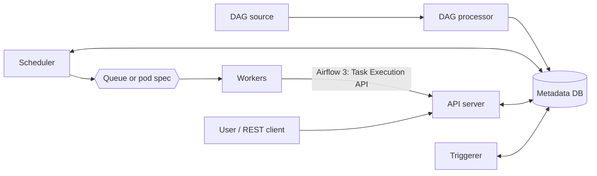
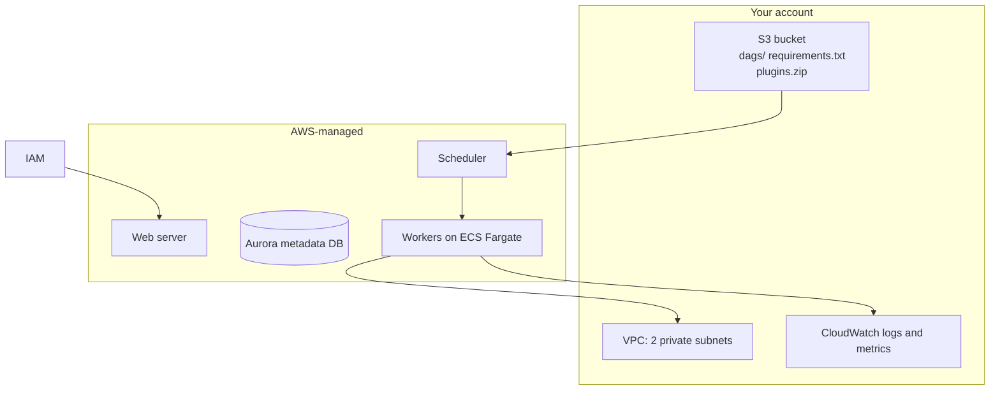
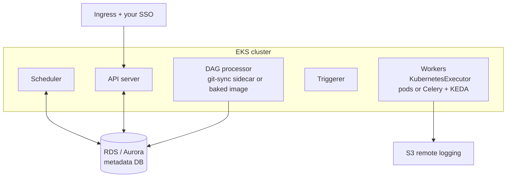

# Hosting Apache Airflow

Airflow is not one process. Hosting it means deciding who runs six long-lived
components and how each one scales:

| Component | Job |
|---|---|
| Scheduler | Decides what runs next and when |
| API server | Serves the user interface and the REST API; in Airflow 3 it also brokers all task access to metadata |
| DAG processor | Parses DAG files into the metadata database |
| Triggerer | Runs deferred/async tasks without holding a worker slot |
| Workers | Execute task code |
| Metadata database | State for everything above |

Every option below answers the same question differently: which of those six you
operate, and which someone else operates for you.

One Airflow 3 change matters for hosting. Task code no longer connects to the
metadata database directly; it goes through the API server over the Task
Execution API. That decoupling is what makes remote and edge workers possible,
so "where do workers run" is becoming a separate decision from "where does the
control plane run".

---

## Amazon MWAA

AWS runs the control plane in its own account. You supply a virtual private
cloud (VPC) with two private subnets, an S3 bucket, and configuration.

Sizing runs from `mw1.micro` to `mw1.2xlarge`, with minimum and maximum worker
counts and, on Airflow 3, two to five schedulers. The executor is
`CeleryExecutor` and is not configurable.

**Pros**

- No cluster, no patching, no metadata database to operate or back up.
- Identity and access management (IAM) is the auth model, including
  `airflow:InvokeRestApi` for programmatic access scoped to an Airflow role.
- Logs and metrics land in CloudWatch without setup.
- Running in a day rather than a sprint.

**Cons**

- `CeleryExecutor` only. No per-task pod sizing and no per-task isolation.
- Dependencies come from `requirements.txt` plus a constraints file. There is no
  custom image, so heavy or native dependencies are genuinely painful.
- AWS controls which Airflow versions exist and they trail upstream. Check the
  supported-versions page before planning an upgrade.
- The base environment bills continuously, roughly 730 hours a month, whether or
  not anything runs. There is no scale to zero.
- Only an allow-listed subset of Airflow settings can be overridden, and some
  changes require an environment restart.
- A private web server cannot be reached by `InvokeRestApi` from outside the
  VPC, which constrains external monitoring and cross-team integration. See
  [`../upstream_monitoring/`](../upstream_monitoring/).

**Fits** teams already on AWS who want orchestration to be someone else's
operational problem and whose task dependencies are ordinary Python.

---

## Self-hosted on EKS

You run everything, usually through the official Apache Airflow Helm chart.

The chart supports `LocalExecutor`, `CeleryExecutor`, `KubernetesExecutor`, and
the hybrid executors. KEDA autoscales Celery workers on queue depth and can
scale them to zero.

**Pros**

- Any executor. `KubernetesExecutor` gives each task its own pod, its own
  resource limits, and real isolation.
- Custom images, so any dependency, including native libraries and private
  packages.
- Any Airflow version, upgraded on your schedule rather than a vendor's.
- Genuine cost control: KEDA scale to zero, Spot node groups, and right-sized
  pools for heavy tasks.
- The full Airflow configuration surface.

**Cons**

- You own upgrades, security patching, metadata database tuning and backups,
  scheduler high availability, ingress, and single sign-on.
- Requires real Kubernetes competence on the team, not a willingness to learn it
  during an incident.
- Run the metadata database on RDS or Aurora, not in-cluster. An in-cluster
  Postgres is the most common way a self-hosted deployment loses state.
- Do not enable KEDA and the horizontal pod autoscaler on the same workload;
  they fight. KEDA also requires worker persistence to be off and supports only
  the Celery executors.
- The cost saving is real only if you already operate EKS. A cluster plus
  engineer time bought purely for Airflow usually costs more than MWAA.

**Fits** teams already running Kubernetes, with spiky or heterogeneous workloads,
or with dependency and version requirements that MWAA cannot express.

---

## The other options

| Option | What it is | When it makes sense |
|---|---|---|
| Google Cloud Composer | GCP's managed Airflow, billed per compute unit hour plus storage | Already on GCP |
| Astronomer Astro | Cloud-agnostic commercial managed Airflow; Local, Celery, and Kubernetes executors | Want managed Airflow without being tied to one cloud, or want the vendor closest to upstream |
| Apache Airflow jobs in Microsoft Fabric | The successor to Azure Data Factory's Workflow Orchestration Manager, which is deprecated and closed to new instances | Already committed to Fabric |
| Self-hosted on EC2 or ECS | Airflow on virtual machines or plain containers, no Kubernetes | Small, stable deployment where a cluster is not justified |
| Docker Compose | The quickstart compose file | Local development and testing only, never production |

---

## Choosing

| If | Then |
|---|---|
| You are on AWS and nobody wants to run infrastructure | MWAA |
| You already run EKS and have Kubernetes skills in the team | Self-hosted on EKS |
| Tasks need custom images, native dependencies, or GPUs | Self-hosted on EKS |
| Load is spiky and idle cost matters | Self-hosted on EKS with KEDA |
| You need an Airflow version AWS has not shipped | Self-hosted on EKS, or Astro |
| You want managed, but not tied to one cloud | Astro |
| The deployment is small and stable | MWAA, or EC2 if the cost case is clear |

The decision that ages worst is dependency management. Version lag and idle cost
are visible and arguable up front; discovering that a task needs a native
library MWAA cannot install tends to surface only after the DAGs are written.
