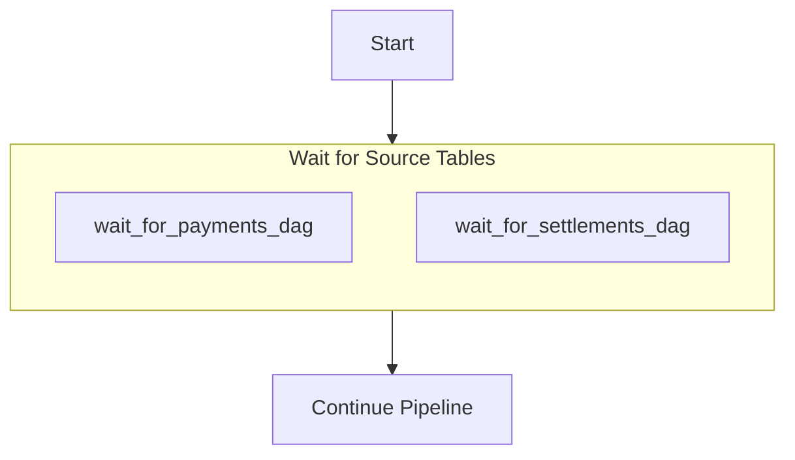

.
---
# TaskGroup
Collapses a set of tasks into a single expandable node in the Airflow Graph View.

```python
from airflow.decorators import dag
from airflow.utils.task_group import TaskGroup
from airflow.sensors.external_task import ExternalTaskSensor
from airflow.operators.dummy import DummyOperator
from datetime import datetime

# Map each upstream source table to its corresponding DAG name
source_table_to_dag_map = {
    'payments':   'payments',
    'settlements': 'settlements',
}

@dag(
    dag_id='example_wait_for_sources',
    start_date=datetime(2025, 1, 1),
    schedule_interval='@daily',
    catchup=False
)
def wait_for_sources_dag():

    start = DummyOperator(task_id='start')

    with TaskGroup(
        group_id='wait_for_source_tables',
        tooltip='Wait until each source-table DAG has finished for this run'
    ) as wait_for_sources_group:

        sensor_tasks = []
        for source_table, source_dag in source_table_to_dag_map.items():
            wait_for_source = ExternalTaskSensor(
                task_id=f"wait_for_{source_table}_dag",
                external_dag_id=source_dag,
                external_task_id=source_table,
                execution_date_fn=get_execution_date,
                check_existence=True,
                timeout=10 * 60,  # 10 minutes
                on_failure_callback=task_fail_slack_alert,
            )
            sensor_tasks.append(wait_for_source)

    downstream = DummyOperator(task_id='continue_pipeline')

    start >> wait_for_sources_group >> downstream

wait_for_sources = wait_for_sources_dag()
```
The actual DAG  is going to look like this: 

