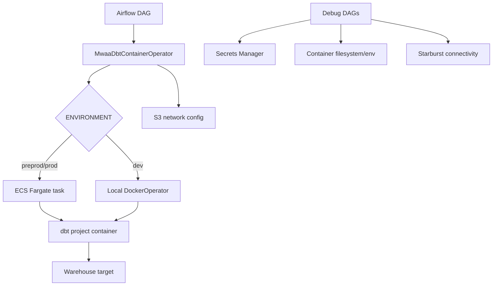

# Airflow MWAA dbt Utilities

Showcase utilities for running and debugging dbt workloads from Apache Airflow
on AWS MWAA, ECS, and local Docker.

Intentionally simple and example-oriented: no package scaffold, no install flow,
and no community-maintenance structure.

## What This Shows

- A custom Airflow operator that runs dbt commands in ECS/Fargate on MWAA.
- A local Docker fallback for development and Airflow testing.
- A generic MWAA CLI trigger operator for launching another DAG with runtime
  configuration.
- Debug DAGs for AWS Secrets Manager, ECS container runtime state, and Starburst
  connectivity.
- A manual dbt command DAG for controlled ad-hoc operational work.

## Files

```text
mwaa_dbt_utilities/
├── README.md
├── diagrams/
│   └── mwaa_dbt_runtime.mmd
├── operators/
│   ├── mwaa_dag_trigger_operator.py
│   └── mwaa_dbt_container_operator.py
└── dags/
    ├── airflow_debug_env_runner_dag.py
    ├── dbt_adhoc_command.py
    ├── debug_aws_secrets.py
    ├── ecs_container_debug_runner.py
    ├── mwaa_info.py
    ├── snowflake_connectivity_test_dag.py
    └── test_starburst_connection.py
```

## Architecture



The same operator interface can run dbt locally or in MWAA/ECS. That lets an
analytics engineering team test a DAG locally while keeping the production path
close to how MWAA actually executes containerized work.

## Example DAGs

### `dags/dbt_adhoc_command.py`

Manual DAG for operational dbt commands, such as:

```json
{"command": "dbt run --target redshift_prod --select marts.finance.revenue"}
```

### `dags/ecs_container_debug_runner.py`

Runs diagnostic shell commands inside the same container runtime used for dbt
jobs. This helps compare what Airflow sees versus what the ECS task sees.

### `dags/debug_aws_secrets.py`

Fetches a configured AWS Secrets Manager secret and logs only the available keys,
never values.

### `dags/test_starburst_connection.py`

Tests Starburst/Trino connectivity across local, CI, and MWAA-style runtimes.

### `dags/airflow_debug_env_runner_dag.py`

The worker-side counterpart to the container debug runner: runs ad-hoc shell
commands on the Airflow worker itself to inspect paths, permissions, and
environment. Together the two answer "does the worker see it, does the
container see it, or neither?"

### `dags/snowflake_connectivity_test_dag.py`

Validates a Snowflake connection end to end (auth, current version, warehouse
reachability) using a Secrets Manager-backed connection id.

### `dags/mwaa_info.py`

Prints the MWAA runtime's platform, Python version, and the full sorted
installed-package list, the first thing support tickets and constraint-file
debugging ask for.

## Safety Notes

- All identifiers are placeholders.
- Do not commit real hostnames, account IDs, secret names, proxy URLs, or bucket
  names.
- The debug DAGs should log metadata only. They should never print secret values.
- Treat ad-hoc dbt command execution as privileged operational access.
