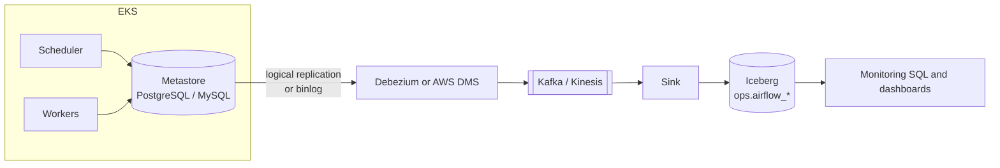

# Airflow Metastore CDC Replication

Replicating a self-managed Airflow metastore into the lake with change data
capture (CDC), so run history is queryable within a couple of minutes instead of
whenever a batch export last ran.

This applies when Airflow runs on EKS, or anywhere the metadata database is an
ordinary PostgreSQL or MySQL instance you operate. It does not apply to MWAA,
where the database sits in an AWS-owned account; use
[`../mwaa_dagrun_export/`](../mwaa_dagrun_export/) there.



## Which tables to replicate

Replicate the run history, not the whole schema. The metastore holds operational
state that is large, sensitive, or both.

| Table | Why |
|---|---|
| `dag_run` | One row per run: state, run type, queued, start, end |
| `task_instance` | Per-task state, duration, try number, hostname, pool |
| `dag` | Names, schedule, paused flag, owners |
| `import_error` | Broken DAG files, which never produce a run at all |
| `job` | Scheduler and triggerer heartbeats, for liveness |

**Exclude `connection` and `variable`.** They hold Fernet-encrypted secrets and
must not leave the metastore. Also exclude `log` and `xcom`: both grow without
bound and `xcom` can contain payload data.

## Source configuration

PostgreSQL needs logical decoding, a publication, and a replication slot:

```sql
-- postgresql.conf
-- wal_level = logical

CREATE PUBLICATION airflow_cdc
FOR TABLE
    public.dag_run,
    public.task_instance,
    public.dag,
    public.import_error,
    public.job;
```

MySQL needs row-based binary logging:

```text
binlog_format = ROW
binlog_row_image = FULL
```

## The failure mode that matters

An inactive or lagging replication slot makes PostgreSQL retain write-ahead log
segments indefinitely. The metastore volume fills, and when it fills, Airflow
stops: the scheduler cannot write, and every running task fails.

This turns a monitoring system into an outage in the thing it was monitoring, so
treat it as a first-class risk rather than a footnote.

- Alert on `pg_replication_slots.active` being false and on
  `pg_wal_lsn_diff(pg_current_wal_lsn(), restart_lsn)` crossing a threshold.
- Drop slots belonging to connectors that have been removed.
- Size the metastore volume with headroom for a connector outage.

```sql
SELECT
    slot_name,
    active,
    pg_size_pretty(
        pg_wal_lsn_diff(pg_current_wal_lsn(), restart_lsn)
    ) AS retained_wal
FROM pg_replication_slots
```

## Schema drift

The metastore schema is Airflow's internal implementation, not a public
contract, and it changes across minor versions. Airflow 3 moved and renamed
enough that queries written against an Airflow 2 metastore need revisiting.

Consequences worth designing for:

- Pin the connector's table list explicitly rather than replicating a whole
  schema, so a new table does not appear unannounced.
- Expect an Airflow upgrade to be a breaking change for anything reading these
  tables, and version the downstream models accordingly.
- Keep the derived model narrow. Select the columns you use rather than
  `SELECT *`, so an added or dropped column does not break the pipeline.

## What you get

The same questions the MWAA export answers, minutes after the fact rather than
the next morning:

```sql
SELECT
    dag_id,
    state,
    run_type,
    queued_at,
    start_date,
    end_date,
    DATE_DIFF('minute', start_date, end_date) AS duration_minutes
FROM ops.airflow_dag_run
WHERE start_date >= CURRENT_DATE - INTERVAL '7' DAY
```

Because the latency is minutes rather than a day, this is usable for gating a
downstream build, which the batch export is not. Combine it with a data-plane
check before acting on it: a successful run is not proof that rows landed.

## Cost and load

CDC reads the write-ahead log rather than querying tables, so steady-state load
on the metastore is low. The real costs are the connector and stream
infrastructure and the small-file pressure of streaming into Iceberg. Compact on
a schedule, or the query side degrades over weeks.
