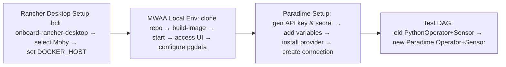

# Airflow MWAA & Paradime Setup 


> **Project Goal**  
> Migrate away from ECS‑based Airflow runs (which were slow to spin up) and move all task execution into Paradime’s BOLT engine. Airflow now serves **only** as an orchestration layer—every command, script, and environment lives in Paradime.

This guide walks you through:

1. Install and Configure Rancher Desktop  
2. Reproduce MWAA Environment Locally  
3. Paradime Setup  
4. Test DAG  

---

## 1. Install and Configure Rancher Desktop

### Why Rancher Desktop?  
We need a local container runtime to build and test images without relying on Docker Desktop or ECS. 
`Rancher Desktop` provides a lightweight k3s Kubernetes cluster plus Moby (dockerd) for Docker CLI compatibility.

### Prerequisites
- **bcli** plugin: automates uninstalling Docker Desktop and installing Rancher Desktop.

### 1.1 Install Rancher Desktop
```bash
bcli onboard-rancher-desktop
```
- **Uninstalls** Docker Desktop if present  
- **Installs** Rancher Desktop  
- **Configures** your shell to use the new runtime  

### 1.2 Switch to Moby (dockerd)
1. Open Rancher Desktop → **Preferences** → **Container Engine**  
2. Select **dockerd (Moby)**  
3. Click **Apply & Restart**  
> _Moby provides the full Docker daemon, so all your existing `docker …` commands continue working._

### 1.3 Configure Docker CLI
By default, Docker expects `/var/run/docker.sock`. This is the primary IPC channel between the Docker client and daemon.
Rancher Desktop’s Moby runtime uses `~/.rd/docker.sock`.This design keeps user‑level tools from requiring root access to /var/run.

Point Docker at Rancher’s Socket Tell the Docker CLI exactly where to connect by setting the DOCKER_HOST environment variable:
```bash
export DOCKER_HOST="unix://$HOME/.rd/docker.sock"
docker ps    # Should list Rancher Desktop containers
```

#### Use Docker Context (optional)
Use the Built‑in Docker Context Docker Context Named endpoints/configurations for Docker CLI; Rancher Desktop auto‑creates a rancher-desktop context. Rancher Desktop auto‑creates a context named rancher-desktop targeting its socket. You can switch to it:
Rancher Desktop auto‑creates a Docker context named `rancher-desktop`:
```bash
docker context use rancher-desktop
docker ps
```

### 1.4 Verify Your Setup
```bash
docker info
docker ps
docker build -t myapp:latest .
```

---

## 2. Reproduce MWAA Environment Locally

> **Note:** This replicates AWS MWAA (Managed Workflows for Apache Airflow) so you can develop and test DAGs exactly as they run in production—without waiting on ECS spin‑ups.

Follow the [aws-mwaa-local-runner](https://github.com/aws/aws-mwaa-local-runner) instructions.

### 2.1 Clone the Repo
```bash
git clone --branch v2.8.1 https://github.com/aws/aws-mwaa-local-runner.git
cd aws-mwaa-local-runner
```

### 2.2 Build the Docker Image
```bash
./mwaa-local-env build-image
```
> **Apple Silicon:** In `docker/Dockerfile` add:
> ```dockerfile
> FROM --platform=linux/amd64 amazonlinux:2023
> ```

> **Note:**  You may need to modify `docker/script/bootstrap.sh` to add the --no-check-certificate flag to `wget` 
`wget` is non‑interactive, so you can kick off long downloads in the background (e.g. over SSH) and let them finish unattended.

### 2.3 Fix Postgres Data Permissions
In `docker-compose-local.yml`, ensure Postgres uses a named volume:
```yaml
version: "3.7"

services:
  postgres:
    image: postgres:13-alpine
    environment:
      - POSTGRES_USER=airflow
      - POSTGRES_PASSWORD=airflow
      - POSTGRES_DB=airflow
    logging:
      options:
        max-size: 10m
        max-file: "3"
    volumes:
      - postgres_data:/var/lib/postgresql/data

  local-runner:
    image: amazon/mwaa-local:2_10_3
    restart: always
    depends_on:
      - postgres
    environment:
      - LOAD_EX=n
      - EXECUTOR=Local
    logging:
      options:
        max-size: 10m
        max-file: "3"
    volumes:
      - "${PWD}/dags:/usr/local/airflow/dags"
      - "${PWD}/plugins:/usr/local/airflow/plugins"
      - "${PWD}/requirements:/usr/local/airflow/requirements"
      - "${PWD}/startup_script:/usr/local/airflow/startup"
    ports:
      - "8080:8080"
    command: local-runner
    healthcheck:
      test: ["CMD-SHELL", "[ -f /usr/local/airflow/airflow-webserver.pid ]"]
      interval: 30s
      timeout: 30s
      retries: 3
    env_file:
      - ./config/.env.localrunner

volumes:
  postgres_data:
```
> Named volumes allow Docker to manage file permissions, avoiding macOS host‑filesystem issues.

### 2.4 Start the Local Airflow
```bash
./mwaa-local-env start
```
- Press `Ctrl+C` to stop both Airflow and Postgres containers.

### 2.5 Access the Airflow UI
- **URL:** `http://localhost:8080/`  
- **Username:** `admin`  
- **Password:** `test`  
---

## 3. Paradime Setup

> **Why Paradime?**  
> BOLT in Paradime runs dbt, scripts, or other tasks in a long‑lived, pre‑warmed environment—eliminating the multi‑minute cold starts we saw on ECS.

### 3.1 Generate API Credentials
In Paradime UI: **Account Settings → Workspace → Generate API Key**  
- **API Key** (public identifier)  
- **API Secret** (private token)  

### 3.2 Add Airflow Variables
In Airflow UI: **Admin → Variables**  
| Key           | Value                                              |
| ------------- | -------------------------------------------------- |
| `X-API-KEY`   | `lmrXXXXXXXXXXXXXXXXXXXXXXXXX`                     |
| `X-API-SECRET`| `pelXXXXXXXXXXXXXXXXXXXXXXXXXXXXXXXXXXXXXXXXXXXXXXXXXX` |
| `URL`         | `https://api.us.paradime.io/api/v1/.../graphql`    |

### 3.3 Install the Paradime Provider
Add to `requirements/requirements.txt`:
```text
airflow-provider-paradime-dbt==1.0.5
```
Rebuild and restart your MWAA local runner:
```bash
./mwaa-local-env build-image
./mwaa-local-env start
```
Validate installation:
```bash
airflow providers list
```
---

## 4. Test DAG

### Overview
With this approach, Airflow triggers a BOLT run in Paradime (via API) and simply waits for it to finish. All actual work happens in Paradime’s environment.

### 4.1 Python Operator
This requires Airflow -> Admin -> Variables to be set up. 
Source: [paradime-airflow-demo](https://github.com/jpooksy/demo-airflow-project)
> _This demonstrates the “manual” approach before using the Paradime provider package._

**dags.py**
```python
# Standard library modules
import datetime
from airflow import DAG
from airflow.operators.dummy_operator import DummyOperator
from airflow.operators.bash_operator import BashOperator
from airflow.operators.python_operator import PythonOperator
from airflow.sensors.python import PythonSensor
from paradime_schedules import run_schedule, get_run_status

DAG_ID = "paradime_bolt_run"
DAG_INTERVAL = "@daily"
SCHEDULE_NAME = "AdHocRun"

with DAG(
    dag_id=DAG_ID,
    schedule_interval=DAG_INTERVAL,
    default_args={"start_date": datetime.datetime.today() - datetime.timedelta(days=1)},
    catchup=False,
) as dag:
    start = DummyOperator("start")
    upstream = BashOperator(
        task_id="example_data_ingestion_task",
        bash_command='echo "data ingestion"',
    )
    bolt_run = PythonOperator(
        task_id=f"start_schedule_run_{SCHEDULE_NAME}",
        python_callable=run_schedule,
        op_args=[SCHEDULE_NAME],
    )
    bolt_status = PythonSensor(
        task_id=f"get_run_status_{SCHEDULE_NAME}",
        python_callable=get_run_status,
    )
    downstream = BashOperator(
        task_id="example_data_upload_task",
        bash_command='echo "data upload"',
    )
    end = DummyOperator("end")

    start >> upstream >> bolt_run >> bolt_status >> downstream >> end
```

**paradime_schedules.py**
```python
from typing import Any
from airflow.models import Variable, TaskInstance
import requests

url = Variable.get("URL")
headers = {
    "Content-Type": "application/json",
    "X-API-KEY": Variable.get("X-API-KEY"),
    "X-API-SECRET": Variable.get("X-API-SECRET"),
}

def run_schedule(schedule_name: str, task_instance: TaskInstance) -> None:
    """
    Trigger a Bolt run in Paradime and push the runId to XCom.
    """
    query = """
mutation trigger($scheduleName: String!) {
  triggerBoltRun(scheduleName: $scheduleName){
    runId
  }
}
"""
    resp = requests.post(url, json={"query": query, "variables": {"scheduleName": schedule_name}}, headers=headers)
    run_id = _extract_gql_response(resp, "triggerBoltRun", "runId")
    task_instance.xcom_push(key="run_id", value=run_id)

def get_run_status(task_instance: TaskInstance) -> bool:
    """Poll Paradime for status, raise on FAILED/ERROR, return False when done."""
    query = """
query status($runId: Int!) {
  boltRunStatus(runId: $runId) {
    state
  }
}
"""
    run_id = int(task_instance.xcom_pull(key="run_id"))
    resp = requests.post(url, json={"query": query, "variables": {"runId": run_id}}, headers=headers)
    state = _extract_gql_response(resp, "boltRunStatus", "state")
    if state in ("FAILED", "ERROR"):
        raise Exception(f"Run {run_id} {state.lower()}")
    return state != "RUNNING"

def _extract_gql_response(response: requests.Response, query_name: str, field: str) -> Any:
    data = response.json()
    if "errors" in data:
        raise Exception(data["errors"])
    return data["data"][query_name][field]
```

### 4.2 Paradime Operator
This requires Airflow → Admin  → Connection to be set up. Click “+ Create” to add a new connection. Fill in:
In Airflow UI: **Admin → Variables**  
| Key           | Value                                              |
| ------------- | -------------------------------------------------- |
| `Conn Id`     | `paradime_bolt`                                    |
| `Description` | `This is the connection that is used to connect to trigger Bolt jobs in Paradime.`|
| `API Key`   | `lmrXXXXXXXXXXXXXXXXXXXXXXXXX`                     |
| `API SECRET`| `pelXXXXXXXXXXXXXXXXXXXXXXXXXXXXXXXXXXXXXXXXXXXXXXXXXX` |
| `API Endpoint`         | `https://api.us.paradime.io/api/v1/.../graphql`    |

In this case, we set up multiple API keys for `local`, `dev`, and `prod` development. 

**test_production_dag.py**
```python
from airflow.decorators import dag
from paradime_dbt_provider.operators.paradime import ParadimeBoltDbtScheduleRunOperator
from paradime_dbt_provider.sensors.paradime import ParadimeBoltDbtScheduleRunSensor

PARADIME_CONN_ID = "paradime_bolt"
BOLT_SCHEDULE_NAME = "AdHocRun"

@dag(default_args={"conn_id": PARADIME_CONN_ID})
def run_bolt_schedule():
    run_task = ParadimeBoltDbtScheduleRunOperator(
        task_id="run_schedule",
        schedule_name=BOLT_SCHEDULE_NAME,
    )
    wait_task = ParadimeBoltDbtScheduleRunSensor(
        task_id="wait_for_schedule",
        run_id="{{ task_instance.xcom_pull('run_schedule') }}",
    )
    run_task >> wait_task

run_bolt_schedule()
```

#### How to Test
1. Add `test_production_dag.py` to your **dags/** folder.  
2. Trigger the DAG via Airflow UI:
 
3. Verify that Paradime BOLT completes:


---
# Testing in production

## What Happened  
- The Airflow task attempted to open a TCP connection to `api.us.paradime.io` but received `ConnectionRefusedError: [Errno 111] Connection refused`, indicating no process was listening on the expected socket.  
- MWAA workers live in private VPC subnets without an Internet Gateway, so they cannot make direct outbound calls.

## Why a Proxy Is Required  
- **Private VPC subnets:** MWAA workers run in private subnets without direct internet access.  
- **Centralized egress control:** Your organization enforces all HTTP/S traffic to flow through a corporate proxy for security, inspection, and compliance.

- `urllib3` lets you route all HTTP(S) traffic through a proxy by creating a ProxyManager (or SOCKSProxyManager) with your proxy URL and then calling its request() method the same way you would a normal PoolManager. 
- Under the covers, Python’s `requests` library (which Airflow’s HTTP hook uses) will automatically pick up the standard HTTP_PROXY, HTTPS_PROXY, ALL_PROXY and NO_PROXY environment variables 
GitHub.
- In MWAA you simply set those in Environment → Variables, pointing them at http://proxy.local:3128, and your Paradime calls will be tunneled correctly. Port 3128 itself is the conventional default listening port for the Squid proxy server, so most corporate proxy appliances use it unless explicitly changed
   ```bash
   HTTP_PROXY="http://proxy.local:3128"
   HTTPS_PROXY="http://proxy.local:3128"
   NO_PROXY="localhost,127.0.0.1,169.254.169.254,api.us.paradime.io"
   ```
The issue is that we are not storing any variables in Airflow, they are all pulled through the `Secrets`, which makes management more secure, yet adds complexity. 


## Proxy Configuration & Solution  
1. **Proxy server details:**  
   - Paradime implemented a change to their `Airflow` provider to allow to configure a proxy.
   - The TCP port was set to `3128` (`http://proxy.local:3128`), the conventional default for Squid deployments. `Squid` is a caching and forwarding proxy server for the Web, designed to reduce bandwidth usage and improve response times by caching content closer to the client.
   - Python’s requests/urllib3 libraries (used by Airflow hooks) automatically respect these variables to route traffic through the proxy.
  
  With the proxy URL and port correctly specified, MWAA’s outbound GraphQL calls to Paradime now succeed.

## Before & After
 
 


# Rebuilding image
**Note**: This would only be needed if you are changeing the folder structure. 
By design, `./mwaa-local-env build-image` first looks for the base image tag (e.g. `amazon/mwaa-local:2_10_3`) and if it’s already present, it prints

```
Container amazon/mwaa-local:2_10_3 exists. Skipping build
```
To re-build the container from scratch: 
1. List your images and confirm the tag:
```shell
docker images | grep amazon/mwaa-local
```
 2. Remove the image: 
```shell
docker rmi amazon/mwaa-local:2_10_3
```
You potentially would run into this if there is still a container running: 
```Error response from daemon: conflict: unable to remove repository reference "amazon/mwaa-local:2_10_3" (must force) - container bb5efa7f4919 is using its referenced image 3b16fb9cc241```
3. Filter for all containers that are using our image: 
```
docker ps --all --filter ancestor=amazon/mwaa-local:2_10_3
```
4. Stop those containers: 
```
docker stop <container_id_or_name>
```
5. Remove them: 
```
docker rm <container_id_or_name>
docker rm -f <container_id_or_name>
```
6. Now, remove the image: 
```
docker rmi amazon/mwaa-local:2_10_3
```
You should see something like this: 
```
Untagged: amazon/mwaa-local:2_10_3
Deleted: sha256:3b16fb9cc2417b1c84b698ab0e7d0fb97
```
7. Now, build from scratch and start:
```
./mwaa-local-env build-image
./mwaa-local-env start
```
