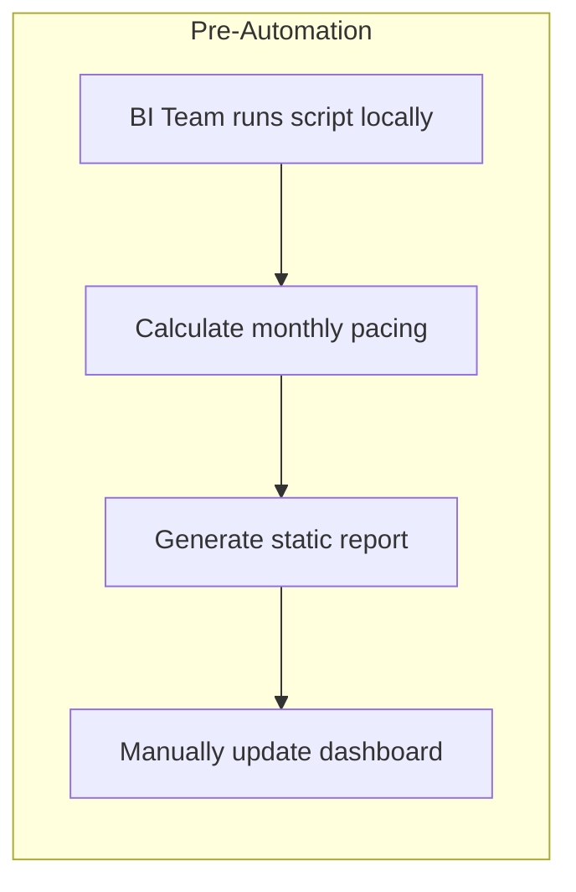
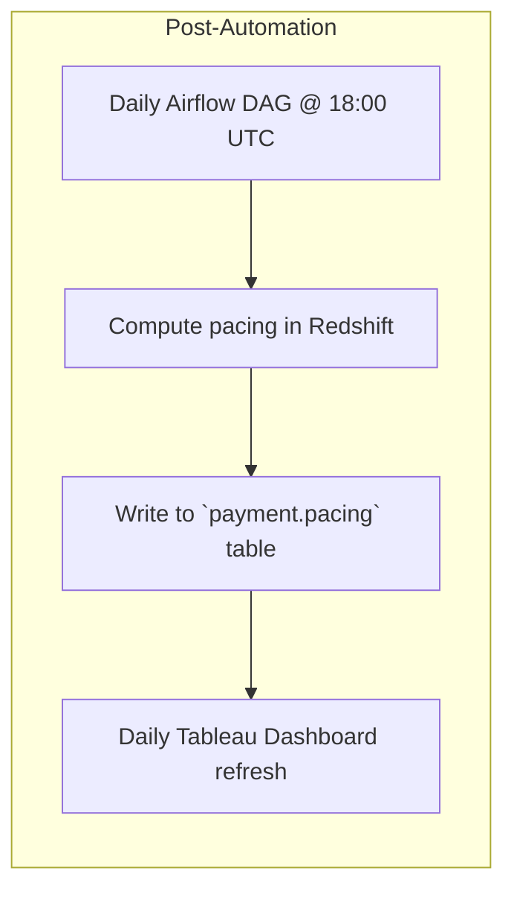
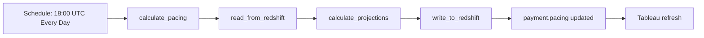

# Payment Volume Pacing DAG

A scheduled Airflow DAG that calculates and writes monthly payment volume projections per payment method, based on business-day pacing using Pandas and Redshift, to enable real-time operational decision-making for the Payments Operations team.

---

## Table of Contents

1. [Background](#background)
2. [Project Overview](#project-overview)
3. [Architecture & Workflow](#architecture--workflow)
4. [Process Before & After](#process-before--after)
5. [Configuration](#configuration)
6. [Key Components](#key-components)
7. [Usage](#usage)
8. [Extensibility & Future Enhancements](#extensibility--future-enhancements)
9. [Contact](#contact)

---

## Background

Before this DAG existed:

- Payments Operations team lacked a real-time view of processing pace.
- BI team ran ad-hoc scripts locally and manually refreshed reports.
- Leadership did not have an automated daily baseline.

After implementation:

- Table `payment.pacing` ingested directly into Tableau.
- Operations team sees daily live pacing vs. goals.
- If behind schedule, run overtime; if ahead, reduce contractor hours.

---

## Project Overview

The **Payment Volume Pacing** DAG runs daily to:

1. Extract raw payment volume data from Redshift.  
2. Calculate projected total volume for the current month per payment method, adjusting for business days and US federal holidays.  
3. Load the projections back into a Redshift table (`payment.pacing`).

This enables real-time decision-making and automated reporting to leadership.

---

## Architecture & Workflow

1. **Trigger**: Cron at `0 18 * * *` (daily at 18:00 UTC).  
2. **Extraction**: `_read_from_redshift` fetches data into a Pandas DataFrame.  
3. **Calculation**: `_calculate_projections` computes business-day pacing.  
4. **Load**: `_write_to_redshift` writes results to `payment.pacing`.  
5. **Visualization**: Tableau automatically refreshes its data source.

---

## Configuration

Make sure the following **Airflow Variables** are set:

| Variable               | Description                          |
|------------------------|--------------------------------------|
| `REDSHIFT_HOST`        | Hostname or endpoint for Redshift    |
| `REDSHIFT_DBNAME`      | Database name                        |
| `REDSHIFT_USER`        | Username                             |
| `REDSHIFT_PASSWORD`    | Password                             |

The DAG’s `default_args` include:

- **owner**: `dymytryo`  
- **depends_on_past**: `False`  
- **email_on_failure**: `True`  
- **retries**: `2` with a `retry_delay` of 55 minutes  

Schedule and catchup:

- **schedule_interval**: `0 18 * * *`  
- **start_date**: `2023-08-08`  
- **catchup**: `False`

---

## Key Components

- **`_create_logger`**: Configures a stdout Python logger with timestamps, file, and line numbers.  
- **`_read_from_redshift`**: Executes a SQL query against Redshift, returns a Pandas DataFrame.  
- **`_calculate_projections`**: Validates inputs, computes business-day pacing and projects monthly volumes.  
- **`_write_to_redshift`**: Writes the two-column projections (`payment_method`, `projected_total_volume`) back to Redshift.  
- **`calculate_pacing`**: Orchestrates the read → calculate → write steps.  
- **DAG**: A single `PythonOperator` with an SLA of 15 minutes.

---

## Usage

1. **Deploy** this Python file into your Airflow `dags/` directory.  
2. **Set** the required Airflow Variables for Redshift connection.  
3. **Verify** the cron schedule aligns with your timezone (UTC 18:00).  
4. **Monitor** runs in the Airflow UI and check logs for pacing details.  
5. **View** the updated `payment.pacing` table in Redshift and the live Tableau dashboard.

---

## Extensibility & Future Enhancements

- **Parameterize Query**: Inject dynamic SQL for filtering by date range or environment.  
- **Parallel Methods**: Use a `TaskGroup` or map operator to calculate each payment method in parallel.  
- **Alerting**: Add email or Slack notifications for anomalous pacing results.  
- **Multi-Environment Support**: Separate Airflow Variables for dev, staging, and prod.  
- **Dashboarding**: Enhance Tableau or build in Superset for richer visualizations.

---

## Contact

For questions or contributions, reach out to **DataOps Team** at dataops@example.com.
