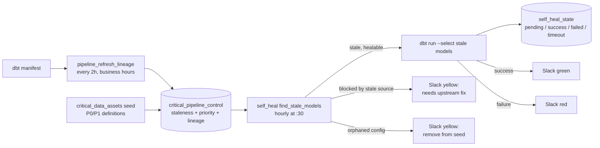

# Self-Healing Critical Pipelines

Closed-loop reliability for dbt models: a lineage builder keeps a control
table of critical assets and their freshness, and a healer DAG reads it every
hour, rebuilds only what is stale, records every attempt in a state table,
and reports in Slack with traffic-light colors. Worst case, a critical model
is refreshed within one hour of missing its SLA (service-level agreement),
with no human in the loop for the routine case.

## How It Works

1. `pipeline_refresh_lineage` rebuilds `model_source_lineage` from the dbt
   manifest every two hours on weekday business hours, feeding
   `critical_pipeline_control`: which monitored models are stale, what
   priority they carry, and whether their upstream sources are fresh.
2. `self_heal_critical_pipelines` runs hourly at :30, offset so the control
   table is never more than 30 minutes older than the decision made on it.
3. `find_stale_models` selects healable models: stale, priority in the
   filter (default P0,P1), still existing in dbt, capped at `max_models`
   (default 5). It marks each `pending` in `self_heal_state`, then hands the
   list to a container task that runs `dbt run --select` on exactly those
   models.
4. `complete_healing` marks successes; a failure callback marks failures
   with a pointer to the logs. Models that actually succeeded before a batch
   failure simply stop being stale and drop out on the next cycle.

## The Judgment Calls

- **Blocked is not healable.** A stale model whose upstream source is also
  stale cannot be fixed by rerunning dbt; healing it would burn compute to
  produce fresh-looking stale data. Those models raise a yellow alert naming
  the source job and its status, and wait for the upstream fix.
- **The loop cleans itself.** `pending` entries older than two hours expire
  as `timeout` (the DAG died mid-heal); models configured as critical but
  deleted from dbt raise an orphan alert asking for a seed cleanup instead
  of failing forever.
- **Guardrails before autonomy.** A hard cap on models per cycle, a
  priority filter, `dry_run` mode for safe testing, `max_active_runs: 1`,
  and zero retries: the next hourly cycle is the retry.
- **Every heal is auditable.** `self_heal_state` records who was healed,
  when, and how it ended, which turns "the pipeline fixed itself" from an
  anecdote into a queryable log.

## Runtime Overrides

Trigger with conf to override defaults:

| Key | Default | Purpose |
| --- | --- | --- |
| `dry_run` | `false` | Report what would be healed without healing |
| `priority_filter` | `P0,P1` | Which priorities are eligible |
| `max_models` | `5` | Cap per cycle |

## Files

- [`self_heal_critical_pipelines.py`](self_heal_critical_pipelines.py): the
  healer: selection queries, state machine, Slack alerts, container tasks.
- [`pipeline_refresh_lineage_dag.py`](pipeline_refresh_lineage_dag.py): the
  control-table builder, config-driven through the shared DAG factory.

Shared helpers referenced by both (Starburst client, Slack alert operator,
DAG factory, container operator) live in the platform's shared utilities
package; a public container-operator implementation is in
[airflow-mwaa-dbt-utilities](https://github.com/dymytryo/airflow-mwaa-dbt-utilities),
and the DAG factory is documented in the
[docker repo walkthrough](https://github.com/dymytryo/docker/blob/main/docs/dag-factory.md).
